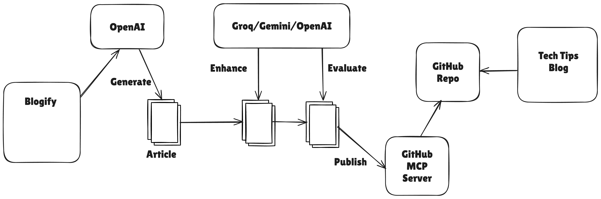

# Blogify
Blogify is a Spring AI playground project to try out various features:

* Integration with multiple LLMs
* Advisors
* ChatMemory
* MCP

## Prerequisites
* Java 24
* Docker, Docker Compose
* OpenAI API Key
* OpenAI compatible LLM(Groq, Gemini, etc) API Key

### OpenAI Config
* Go to https://platform.openai.com/api-keys and create an API Key
* Set environment variable `OPENAI_API_KEY=YOUR_TOKEN_VALUE_HERE`

### Groq Config
* Go to https://console.groq.com/keys and create an API Key
* Set environment variable `GROQ_API_KEY=YOUR_TOKEN_VALUE_HERE`

### Gemini Config
* Go to https://aistudio.google.com/app/apikey and create an API Key
* Set environment variable `GEMINI_API_KEY=YOUR_TOKEN_VALUE_HERE`

### GitHub Repository Config
From this application, we can generate an article in Markdown format and push it to your GitHub repo using GitHub MCP.

* Go to [GitHub Developer Settings](https://github.com/settings/apps) and create a PAT (Personal Access Token)
* Set environment variable `GITHUB_PERSONAL_ACCESS_TOKEN=YOUR_TOKEN_VALUE_HERE`
* You need to update your repository details using one of the following ways:
  * Update the properties `app.github-repo` and `app.github-repo-content-dir` in `application.properties` 
  * Set environment variables `APP_GITHUB_REPO` and `APP_GITHUB_REPO_CONTENT_DIR` to your values.

